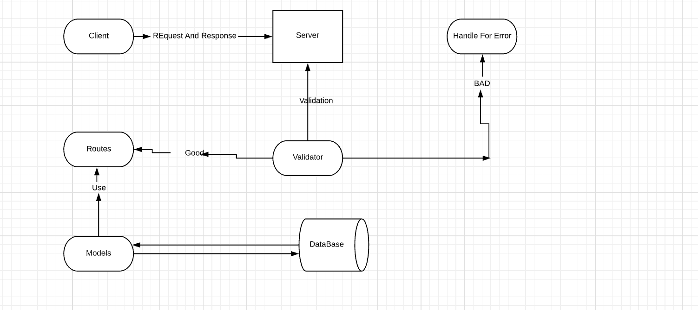

# basic-api-server

> in this class i know so many thing like 

+ middleware
+ supertest
+ workflows
+ jest
+ DataBase

> Today the instructor gave us something new regarding the CI/CD for deploying the backend & also he gave us notes regarding the HTTP numbers (200,404,500) which are based on the website status which we implemented in the class.

 # UML
 

## [ Heroku ](https://labeeee.herokuapp.com/)

***

## [pull request](https://github.com/EmadIdris/basic-api-server/pull/4#partial-pull-merging)
